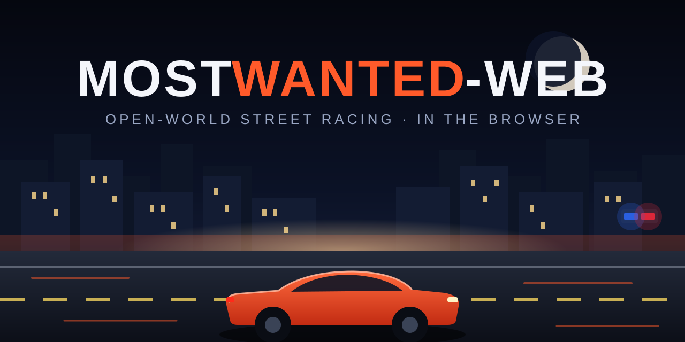

<div align="center">



# MostWanted-Web 🏁

**An open-world street racing game that runs in your browser.** Inspired by *Need for Speed: Most Wanted (2005)* — free-roam a 3D city, win street races, outrun police pursuits with escalating heat, and climb the Blacklist to become #1.


**▶ Play it live: `https://kamalesh404.github.io/mostwanted-web/`** *(published automatically by GitHub Actions on every push to `main`)*

</div>

---

## 🎮 What is this?

A complete, self-contained arcade racing game built as a **non-commercial fan tribute** to NFS Most Wanted 2005 — rebuilt from scratch for the web. No engine downloads, no installs: open the link and drive. Every car and building is a **real 3D model (GLB)**, not placeholder boxes (attribution in [CREDITS.md](CREDITS.md)).

### Core loop
```
Free roam the city → win street races → attract police heat → evade pursuits
        ▲                                                   │
        └── win boss races, take their car ◄── challenge Blacklist boss
```

### Features

| | |
|---|---|
| 🌆 **Open-world city** | 9×9-block 3D city with traffic, parks, parking lots and real building models |
| 🏎️ **8 drivable cars** | Distinct stats, buyables + boss rewards; Engine / Handling / Nitrous upgrade trees |
| 🚓 **Police pursuits** | Pursuit meter, **heat levels 1–5**, ramming interceptors, roadblocks, spike strips — evade or get busted and fined |
| 🏁 **Street races** | 5 checkpoint races (sprints + circuits) paying cash; finish 1st |
| 👑 **Blacklist** | 5 bosses (Razor → Sonny); earn the right to challenge them, beat a boss to take their car |
| 💾 **Auto-save** | Cash, cars, upgrades and blacklist progress persist in `localStorage` |
| 🔊 **Procedural audio** | Engine, sirens, skids and crashes synthesized live with Web Audio — zero audio files |
| 📱 **Mobile support** | On-screen steering, NOS and brake buttons with auto-throttle |

## ⌨️ Controls

| Action | Keys |
|---|---|
| Drive / steer | `WASD` or arrow keys |
| Nitrous | `Shift` |
| Handbrake / drift | `Space` |
| Action (start race / garage) | `E` |
| Camera (chase / far / hood) | `C` |
| Mute | `M` |

## 🛠️ Tech stack

- **Vite + TypeScript + three.js** — fast static build, one runtime dependency
- **Custom arcade physics** — velocity, drift, grip, impulse collisions (no heavyweight physics engine)
- **GLTF/Draco asset pipeline** — 14 MB of real GLB models, loading screen with progress
- **Web Audio API** — fully procedural sound design
- **GitHub Actions** — CI build + deploy to GitHub Pages on every push

## 🚀 Run locally

```bash
git clone https://github.com/kamalesh404/mostwanted-web.git
cd mostwanted-web
npm install
npm run dev      # http://localhost:5173
npm run build    # static bundle in dist/
npm run preview
```

Total payload is ~15 MB (14 MB of GLB models) — the loading screen shows progress.

## ☁️ Deploy to GitHub Pages

A workflow at [.github/workflows/deploy.yml](.github/workflows/deploy.yml) builds and deploys on every push to `main`. In the repo settings, set **Pages → Source → GitHub Actions**. The Vite base path is set automatically from the repository name.

## 📁 Project structure

```
mostwanted-web/
├── index.html
├── public/
│   ├── models/        # GLB car/building/prop models (real 3D assets)
│   └── textures/
├── src/
│   ├── main.ts        # game loop, renderer, state machine
│   ├── assets.ts      # GLTF loading, Draco, pooling, progress screen
│   ├── city.ts        # city assembly from road/building assets
│   ├── car.ts         # car controller + arcade physics
│   ├── ai.ts          # rival racers + traffic
│   ├── police.ts      # pursuit AI, heat levels, roadblocks
│   ├── races.ts       # sprint/circuit race logic
│   ├── blacklist.ts   # rival ladder + rewards
│   ├── garage.ts      # car selection + upgrades
│   ├── hud.ts         # speedometer, nitrous, pursuit meter, minimap
│   ├── audio.ts       # procedural sounds
│   └── save.ts        # localStorage persistence
└── docs/banner.svg    # project banner
```


## ⚖️ License

Code: MIT. Game assets: see [CREDITS.md](CREDITS.md) (CC0 / CC-BY 3.0 / one CC-BY-NC model used non-commercially).

---

<div align="center">
<sub>Star ⭐ the repo if you enjoy the game — PRs welcome!</sub>
</div>
